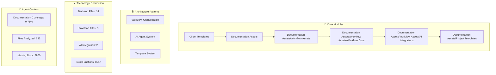
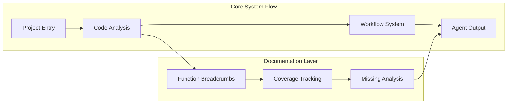
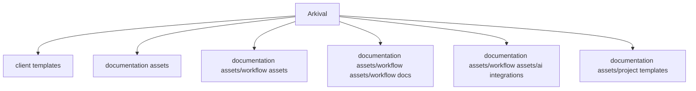

# Arkival - Dynamic Architecture Analysis

*Auto-generated from codebase structure analysis*
*Version: 1.1.39 | Generated: 2025-06-18T22:13:31Z*

## Core System Architecture

## Module Relationships

## Directory Structure Map

---
*Dynamic architecture analysis - reflects actual codebase structure*  
*Core Directories: 6 | Patterns: 3 | Coverage: 0.71%*
