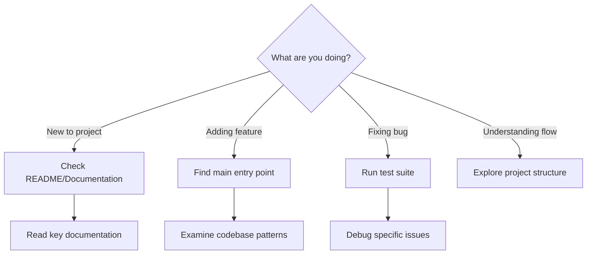
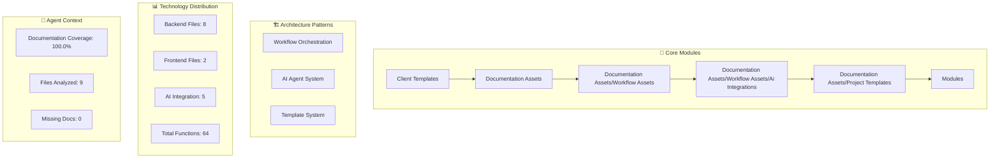
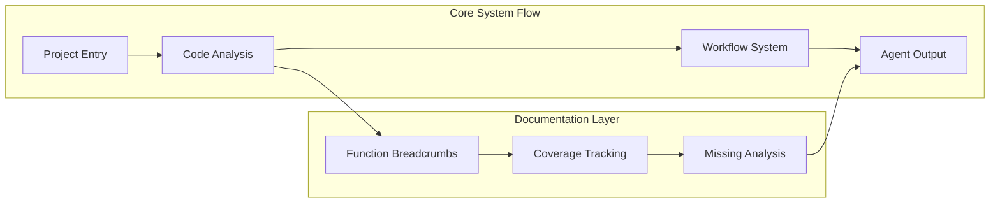
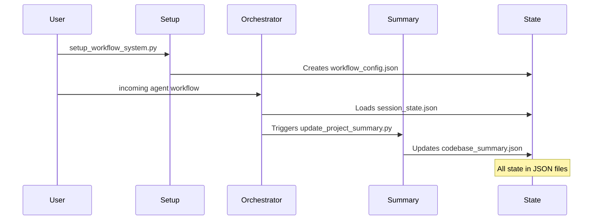
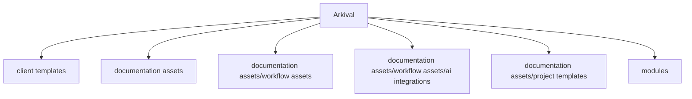

# Arkival - Dynamic Architecture Analysis

*Auto-generated from codebase structure analysis*
*Version: 1.1.3 | Generated: 2025-06-22T00:06:25Z*

## ⚠️ Version Systems - IMPORTANT
| System | Current | Purpose | Updates |
|--------|---------|---------|---------|
| **Codebase Analysis** | v1.1.3 | Documentation scan version | Every `update_project_summary.py` run |
| **Changelog/Project** | vNone | Feature release version | Major milestones only |

**These are INDEPENDENT systems - version mismatch is NORMAL and EXPECTED**

## 🎯 30-Second Overview
| What | Details |
|------|---------|
| **System Type** | AI Agent Workflow Orchestration System for seamless knowledge transfer between AI agents and human developers |
| **Architecture** | Python Application |
| **State Management** | In-memory/Custom |
| **Current State** | operational |
| **Deployment Mode** | standalone |

## 🗺️ Where Should I Start?

## 🔥 Critical Areas
- **Active Issues**: 0 current issues
- **Missing Docs**: 0 functions (see missing_breadcrumbs.json)
- **Complexity**: low complexity project
- **Critical Files**: session_state.json, workflow_config.json, missing_breadcrumbs.json

## Core System Architecture

## Module Relationships

## 🔥 Critical Execution Paths

## Directory Structure Map

---
*Dynamic architecture analysis - reflects actual codebase structure*  
*Core Directories: 6 | Patterns: 3 | Coverage: 100.0%*
