# Arkival - Architecture Diagrams

*Generated by: codebase_summary/update_project_summary.py - Enhanced project summary generator*
*Last updated: 2025-06-18 08:07:30 UTC*
*Generated from codebase analysis - Version: 1.1.10*
*Architecture analysis system*

## System Overview


## Technology Stack Analysis

```mermaid
graph LR
    subgraph "🎯 Detected Architecture Patterns"
        
    end

    subgraph "🤖 AI Integration Layer"
        
    end

    subgraph "📊 Project Statistics"
        STATS1[Files: 48]
        STATS2[Functions: 625]
        STATS3[Coverage: 9.8%]
        STATS4[AI Providers: 0]
    end
```


## Workflow System Architecture

```mermaid
flowchart TD
    subgraph "🔄 Agent Workflow System"
        A1[Incoming Agent Workflow]
        A2[Outgoing Agent Workflow]
        A3[Documentation Updates]
        A4[Feature Validation]
    end

    subgraph "📈 Analysis Pipeline"
        B1[Codebase Scanning]
        B2[Breadcrumb Extraction]
        B3[Architecture Detection]
        B4[Coverage Calculation]
    end

    subgraph "📝 Output Generation"
        C1[Summary JSON]
        C2[Markdown Documentation]
        C3[Architecture Diagrams]
        C4[Missing Breadcrumbs Report]
    end

    A1 --> B1
    A2 --> B1
    A3 --> B1
    B1 --> B2
    B2 --> B3
    B3 --> B4
    B4 --> C1
    B4 --> C2
    B4 --> C3
    B4 --> C4

    classDef workflow fill:#e3f2fd,stroke:#1976d2
    classDef analysis fill:#f3e5f5,stroke:#7b1fa2
    classDef output fill:#e8f5e8,stroke:#388e3c

    class A1,A2,A3,A4 workflow
    class B1,B2,B3,B4 analysis
    class C1,C2,C3,C4 output
```


## Deployment Architecture
```mermaid
flowchart LR
    subgraph "🔧 Development Mode"
        DEV1[Project Root]
        DEV2[codebase_summary.json]
        DEV3[changelog_summary.json]
        DEV4[codebase_summary/ directory]
        
        DEV1 --> DEV2
        DEV1 --> DEV3
        DEV1 --> DEV4
    end
    
    subgraph "🆕 Subdirectory Mode"
        SUB1[Project Root]
        SUB2[arkival_config.json]
        SUB3[Arkival/ directory]
        SUB4[Arkival/data/ files]
        
        SUB1 --> SUB2
        SUB1 --> SUB3
        SUB3 --> SUB4
    end
    
    subgraph "🧠 Universal Path Resolution"
        DETECT[Auto-Detection Logic]
        CONFIG[find_arkival_paths()]
        PATHS[Dynamic Path Assignment]
        
        DETECT --> CONFIG
        CONFIG --> PATHS
    end
    
    DEV1 --> DETECT
    SUB1 --> DETECT
    PATHS --> DEV2
    PATHS --> SUB4
    
    classDef dev fill:#e3f2fd,stroke:#1976d2
    classDef sub fill:#f3e5f5,stroke:#7b1fa2
    classDef path fill:#e8f5e8,stroke:#388e3c
    
    class DEV1,DEV2,DEV3,DEV4 dev
    class SUB1,SUB2,SUB3,SUB4 sub
    class DETECT,CONFIG,PATHS path
```

## Enhanced Documentation Coverage


---
*Architecture diagrams are auto-generated from codebase analysis*
*Coverage: 9.8% | Functions: 625 | Files: 48*
