# New Project - Architecture Diagrams

*Last updated: 2025-06-17 18:59:17 UTC*
*Generated from codebase analysis - Version: 1.1.377*

## System Overview

## Technology Stack Analysis

```mermaid
graph LR
    subgraph "🎯 Detected Architecture Patterns"
        
    end

    subgraph "🤖 AI Integration Layer"
        
    end

    subgraph "📊 Project Statistics"
        STATS1[Files: 47]
        STATS2[Functions: 59]
        STATS3[Coverage: 100.0%]
        STATS4[AI Providers: 0]
    end
```

## Workflow System Architecture

```mermaid
flowchart TD
    subgraph "🔄 Agent Workflow System"
        A1[Incoming Agent Workflow]
        A2[Outgoing Agent Workflow]
        A3[Documentation Updates]
        A4[Feature Validation]
    end

    subgraph "📈 Analysis Pipeline"
        B1[Codebase Scanning]
        B2[Breadcrumb Extraction]
        B3[Architecture Detection]
        B4[Coverage Calculation]
    end

    subgraph "📝 Output Generation"
        C1[Summary JSON]
        C2[Markdown Documentation]
        C3[Architecture Diagrams]
        C4[Missing Breadcrumbs Report]
    end

    A1 --> B1
    A2 --> B1
    A3 --> B1
    B1 --> B2
    B2 --> B3
    B3 --> B4
    B4 --> C1
    B4 --> C2
    B4 --> C3
    B4 --> C4

    classDef workflow fill:#e3f2fd,stroke:#1976d2
    classDef analysis fill:#f3e5f5,stroke:#7b1fa2
    classDef output fill:#e8f5e8,stroke:#388e3c

    class A1,A2,A3,A4 workflow
    class B1,B2,B3,B4 analysis
    class C1,C2,C3,C4 output
```

## Enhanced Documentation Coverage

---
*Architecture diagrams are auto-generated from codebase analysis*
*Coverage: 100.0% | Functions: 59 | Files: 47*
